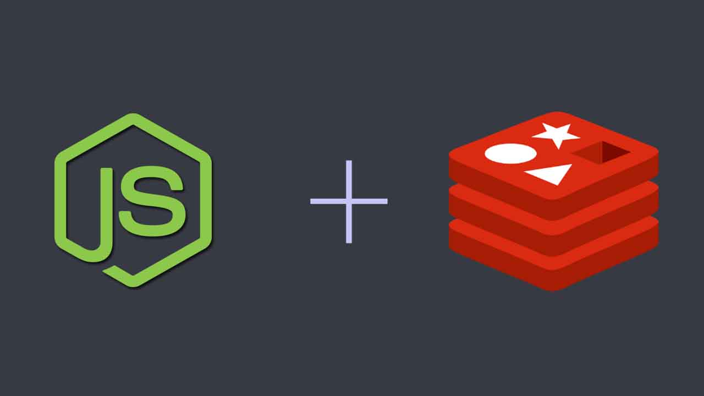

# TypeScript Cache Redis

Este repositório do GitHub é dedicado a armazenamento em cache com Redis. O Redis é um banco de dados em memória que pode ser usado como um cache para acelerar o acesso a dados frequentemente acessados. Este repositório contém exemplos e documentação sobre como implementar o Redis como uma camada de cache em sua aplicação, além de outras ferramentas e recursos para ajudá-lo a otimizar o desempenho e a escalabilidade do cache com Redis. Com este repositório, você pode aprender como tirar o máximo proveito do Redis para melhorar a velocidade e a eficiência da sua aplicação.



## Instalar Dependencias

```sh
  npm install
```

## Compilar Projeto

```sh
  npm run build
```

## Iniciar o Projeto

```sh
  docker run redis

  npm run start
```
